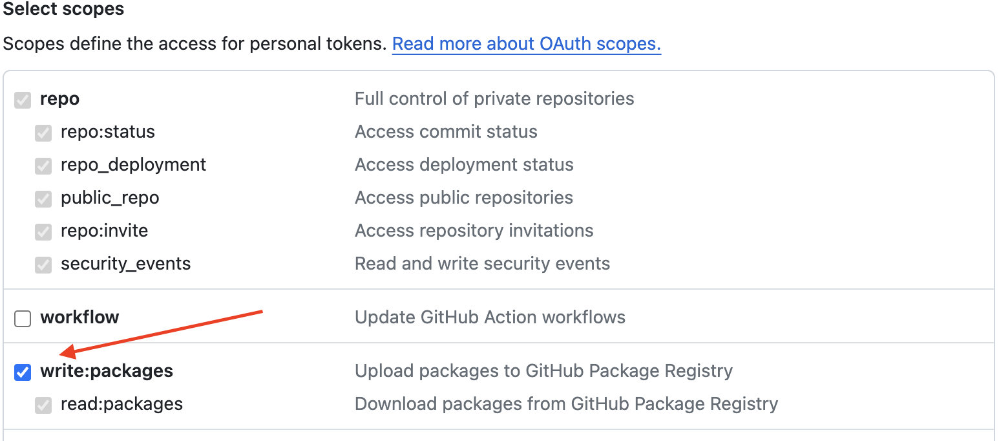
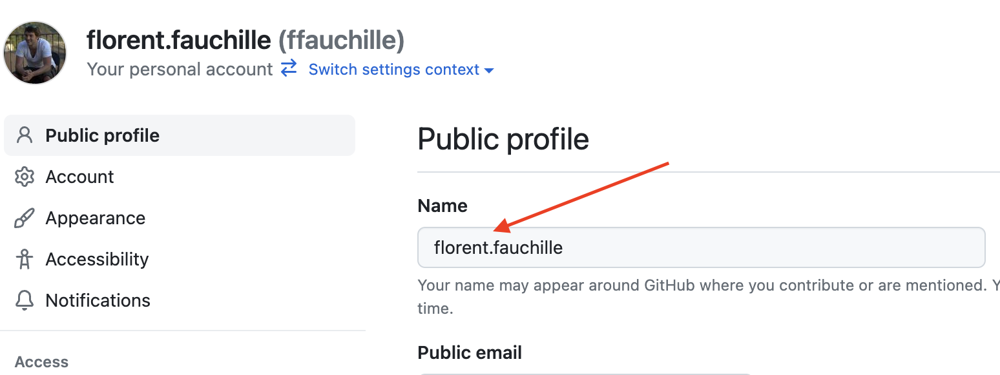

# TP#5: Images docker et docker compose

**Ojbectifs**: 

- créer les images pour les différents processus d'hetic tac toe:
  - **frontend**: la partie du code écrite en ReactJS
  - **backend**: la partie du code écrite en Python
- utiliser le plugin [**docker compose**](https://docs.docker.com/compose/) pour lancer les manipuler les conteneurs
- déployer les conteneurs sur une machine distante (avec un hôte Docker d'installé)

## Étape 1: Se familiariser avec les commandes principales des images Docker

Un conteneur Docker est **toujours** run (lancé) à partir d'une **image**. 

> Note: Si l'on fait un parallèle avec la programmation orienté objet, l'**image** est la `class` et le conteneur est une 
> **instance** de cette `class`

Vous pouvez lister les images présentent sur votre hôte Docker via la commande:

```sh
docker image ls
```

Vous pouvez utiliser des images Docker qui sont hébergées sur une *registry* Docker publique: [Docker hub](https://hub.docker.com/).
Docker hub fournit une solution simple qui permet de partager gratuitement des images docker **publiques**.
Si vous souhaitez utiliser des images docker privées (non ouverte à tous), vous pouvez créer un compte sur docker hub ou utiliser d'autre
*registry* docker.

> Note: Github fournit une *registry* Docker: [ghcr pour **G**it**H**ub **C**ontainer **R**egistry](https://docs.github.com/fr/packages/working-with-a-github-packages-registry/working-with-the-container-registry)

Les commandes `docker image pull` et `docker image push` vous permette de respectivement récupérer et envoyer des images docker depuis
votre poste de travail vers une *registry* Docker.

Par défaut, votre hôte Docker est configuré pour récupérer des images sur Docker hub.

Vous pouvez récupérer une image ubuntu via la commande:

```sh
docker image pull ubuntu:latest
```

Cette commande va récupérer la dernière image d'ubuntu qui a été `push` (envoyée) sur Docker hub.
Vous pouvez trouver les détails de cette image sur [la page de l'image ubuntu sur Docker hub](https://hub.docker.com/_/ubuntu).

Le mot `latest` est une convention qui permet de récupérer l'image ubuntu avec le `tag` le plus récent.

Sur la page [la page de l'image ubuntu sur Docker hub](https://hub.docker.com/_/ubuntu), vous pouvez naviger sur l'onglet `Tags` et 
récupérer une version spécific d'ubuntu pour votre application.

Par exemple, la commande suivant va récupérer l'image `ubuntu` taggée `24.04`:

```sh
docker image pull ubuntu:24.04
```

Vous pouvez supprimer l'image de votre poste de travail en tapant la commande:

```sh
docker image rm ubuntu:24.04
```

L'avantage de supprimer une image est d'économiser de l'espace de disque sur votre hôte Docker.

## Étape 2: Créer les images pour hetic tac toe

Docker vous offre deux options pour créer vos images:

1. via la commande `docker container commit`
1. via la commande `docker image build` et un fichier `Dockerfile`

La première option n'est pas recommandée et n'est utiliser que dans des cas très spécifiques.

Nous allons uniquement nous intéresser à la seconde option en écrivant nos fichier `Dockerfile` puis en utilisant la commande `docker image build`.

C'est l'option recommandée pour créer les images Docker pour vos applications.

### Récupérez le code du projet hetic tac toe

Si vous ne l'avez pas déjà, vous pouvez clone le projet Github d'hetic-tac-toe via:

```sh
# depuis votre terminal, depuis votre dossier où vous souhaitez que le projet
# soit clone
git clone https://github.com/ffauchille/hetic-tac-toe.git
```

### Dockerfile du frontend d'hetic tac toe

- Dans le dossier `frontend/` du projet `hetic-tac-toe`, vous devriez trouver un fichier `Dockerfile`
- Assurez-vous que le contenu du fichier `frontend/public/env-config.json` est bien:

```json
{
    "apiDomain": "localhost:8000"
}
```

- Lancez le build de l'image du frontend via:

```sh
# depuis votre dossier frontend/
docker image build -t hetic-tac-toe-frontend:local .
```

Vous pouvez lister votre image qui vient d'être créée:

```sh
docker image ls
```

Vous devriez avoir une image `hetic-tac-toe-frontend` avec le la version `local`.

### Dockerfile du backend d'hetic tac toe

- Dans le dossier `backend/` du projet `hetic-tac-toe`, vous devriez trouver un fichier `Dockerfile`
- Lancez le build du backend via:

```sh
docker image build -t hetic-tac-toe-backend:local .
```

### Testez l'application sur localhost

Lancez d'abord le conteneur du backend en tâche de fond:

```sh
docker container run --name backend -d --rm -p 8000:8000 hetic-tac-toe-backend:local 
```

- `-d` est un flag pour lancer le conteneur en mode détaché (e.g. *daemon*)
- `--rm` est un flag qui va supprimé le conteneur une fois stoppé. Cela évite d'avoir des conteneurs stoppés sur votre système et de ne pas avoir à penser à les supprimer manuellement (via `docker container rm ...` ou `docker system prune`)
- `-p` est une option qui vous permet d'ouvrir la connexion depuis un port de votre `localhost` vers un port de votre conteneur. Ici, notre conteneur écoute les requêtes entrantes sur le port `8000`. Le `-p 8000:8000` `map` le port `8000` de votre conteneur sur le port `8000` de votre localhost. Ainsi, en envoyant une requête HTTP à l'adresse `http://localhost:8000` votre requête est envoyée sur le port `localhost:8000` à l'intérieur de votre conteneur `hetic-tac-toe-backend:local`.

Puis lancez le conteneur du frontend en tâche de fond:

```sh
docker container run --name frontend -d --rm -p 8080:80 hetic-tac-toe-frontend:local
```

- `-p 8080:80` vous expose le frontend sur votre `http://localhost:8080`

Vous pouvez lister vos conteneurs en cours d'exécution via:

```sh
docker container ps
# Note: la commande `docker container ls` fonctionne pareil
```

Vous pouvez désormais tester l'application sur le port en accédant à [localhost:8080](http://localhost:8080)

## Étape 3: Déploiment d'hetic tac toe version Docker

**Objectifs**: Déployer le conteneur frontend et backend sur votre VM d'étudiant hébergé chez Scaleway

Vous allez apprendre à:
- utiliser `docker login` pour vous connecter à une registry docker
- utiliser `docker image push` et `docker image pull` pour envoyer et récupérer des images docker vers et depuis une registry Docker
- labéliser des conteneurs pour qu'ils soient exposés par `Traefik`

> Note: Traefik est un web server (comme Nginx) qui est né pour fonctionner parfaitement avec Docker.
>
> Traefik inspecte tous les conteneurs qui sont lancés et récupère les [`LABEL`](https://docs.docker.com/config/labels-custom-metadata/) docker des conteneurs.
> En fonction des `LABEL`, Traefik va générer la configuration pour `reverse-proxy` les requêtes HTTP vers les bons conteneurs.
> Plus d'informations ici: https://docs.traefik.io/?__hstc=265350736.b8372f9d02e9354a7959f956d9ae00cd.1600363912360.1600363912360.1600363912360.1&__hssc=265350736.1.1600363912360&__hsfp=3215949073

Cela veut dire que vous n'allez **PAS** avoir à installer d'autre serveur web sur votre serveur distant.

### Configurer votre accès à la registry Docker de Github

Github fournit une registry Docker: [`ghcr.io`](https://ghcr.io) (ghcr pour **G**it**H**ub **C**ontainer **R**egistry).

Cette registry est **privée** et réservé à **votre** compte sur Github. Ceci vous permets de ne pas publier de conteneur qui sont accessible à tous (comme sur la Docker registry publique DockerHub par exemple).

Pour vous authentifier à votre registry Docker privée de Github depuis votre terminal, vous devez:
- générer un token d'accès depuis votre compte Github perso
- utiliser ce token avec la commande `docker login` depuis votre terminal

Une fois authentifié, vous pouvez alors utiliser la commande `docker image push` pour envoyer vos conteneur sur votre registry Docker privée.

Pour générer un token classic depuis votre compte Github, suivez les instructions ici: [Création d’un personal access token (classic)](https://docs.github.com/fr/authentication/keeping-your-account-and-data-secure/managing-your-personal-access-tokens#cr%C3%A9ation-dun-personal-access-token-classic)

**IMPORTANT**: lorsque vous créez votre token, cochez bien le scope `write:packages`


**Gardez votre token sur votre poste de travail (surtout ne pas le push!). Vous en avez besoin dans les étapes suivantes**.

### Push de vos images d'hetic tac toe sur votre registry Docker

#### Format d'image docker pour `ghcr.io`

Github vous impose une convention de nomage sur vos images que vous souhaitez envoyer/récupérer sur `ghcr.io`.
De plus, votre image du frontend doit être configurée pour votre production.
Votre backend sera exposé à l'adresse `https://api.hetic-tac-toe.etudiantXX.floless.fr`, il vous faut donc mettre à jour le fichier `frontend/public/env-config.json`.

- Changez le fichier `frontend/public/env-config.json` (en remplçant `etudiantXX` par votre identifiant d'étudiant) par:

```sh
{
    "apiDomain": "api.hetic-tac-toe.etudiantXX.floless.fr"
}
```

Il vous faut build vos images avec le bon nom:
- Pour ceux qui sont sur windows OU linux:
  - depuis le projet `hetic-tac-toe`, dans le dossier `frontend/`

```sh
# si vous n'êtes PAS sur un Mac avec puce Apple M1 ou M2
docker build -t ghcr.io/<VOTRE_ID_GITHUB>/hetic-tac-toe-frontend:v1
# sinon
docker buildx build --platform linux/amd64 -t ghcr.io/<VOTRE_ID_GITHUB>/hetic-tac-toe-frontend:v1
```

  - depuis le projet `hetic-tac-toe`, dans le dossuer `backend/`

```sh
# si vous n'êtes PAS sur un Mac avec puce Apple M1 ou M2
docker build -t ghcr.io/<VOTRE_ID_GITHUB>/hetic-tac-toe-backend:v1
# sinon
docker buildx build --platform linux/amd64 -t ghcr.io/<VOTRE_ID_GITHUB>/hetic-tac-toe-backend:v1
```

> Note: Un mot sur la commande docker `buildx`
> 
> Une des promesse de Docker, c'est que vos images tournent sur n'importe quel hôte Docker peut importe le système d'exploitation (ubuntu, > windows, macOS...).
> 
> C'est vrai... à une expection près: l'architecture du processeur de la machine.
> 
> Lancer un conteneur Docker, c'est lancer un processus isolé sur une machine. Malheureusement, un processus en execution est fortement > lié au processeur de la machine sur lequel ce processus est exécuté.
> 
> Pas de panique, Docker a intégrer une commande pour publier des images qui peuvent être lancées par différentes architecture de > processeurs: `buildx`.
> 
> Vous pouvez listez toutes les architectures cible que **votre** hôte Docker installé sur votre poste de travail est capable de build via:
> ```sh
> docker buildx ls
> ```
> 
> Votre VM ubuntu peut lancer des images compatibles avec la plateforme `linux/amd64`.
> 
> L'outil `buildx` de Docker devient plus important avec l'apparition des puces Appel M1 et M2 des nouveaux ordinateurs Mac.
> 
> En effet, très souvent, les serveurs distants on pour leur grande majorité des processeurs Intel avec des processeurs `amd`.
> Si vous avez un ordinateur Mac récent avec les puces Appel M1 ou M2, votre architecture de processeur est `arm`.
> Si vous souhaitez build une image Docker depuis votre Mac et lancer cette même image sur un serveur distant `amd`, vous devez utiliser la commande:
> 
> ```sh
> # build d'une image avec le tag mon-image, supposant
> # qu'un fichier Dockerfile est présent dans le dossier courant
> docker buildx build --platform linux/amd64 -t mon-image:v1 .
> # au lieu de `docker build -t mon-image:v1 .`
> ```

#### `push` des images sur `ghcr.io`

Authentifiez vous à `ghcr.io` via la commande `docker login` en remplaçant
- `TOKEN` par le token que vous avez généré précédemment
- `VOTRE_ID_GITHUB` par votre identifiant Github. Vous le trouvez sur votre page de profile Github:


> **IMPORTANT**: si vous avez des charactères spéciaux dans votre username (comme un `.`, un espace etc...),
vous devez le retirer.
> Par exemple, si le votre ID Github est `florent.fauchille` alors `VOTRE_ID_GITHUB` doit être `florentfauchille`

```sh
echo "TOKEN" | docker login ghcr.io -u VOTRE_ID_GITHUB --password-stdin

> Login Succeeded
```

Une fois que vous voyez le message `Login Succeeded`, vous pouvez envoyer vos conteneurs:

- envoyer le conteneur du backend via la commande:

```sh
docker image push ghcr.io/<VOTRE_ID_GITHUB>/hetic-tac-toe-backend:v1
```

- envoyer le conteneur du frontend via la commande:

```sh
docker image push ghcr.io/<VOTRE_ID_GITHUB>/hetic-tac-toe-frontend:v1
```

### Pull de vos images depuis votre VM de chez Scaleway

**Objectif**: récupérer les images depuis votre registry Docker de Github lorsque vous êtes sur votre VM de chez Scaleway.

- Connectez-vous en `ssh` à votre VM d'étudiant (en remplaçant `etudiantXX` par votre identifiant d'étudiant)
> Note: Vos machines ont été détruites entre les deux cours. Vous devez exécuter la commande `ssh-keygen -R etudiantXX.floless.fr`
> pour supprimer l'historique de connexion avant de vous connecter à nouveau en `ssh` avec la même clé privé à votre machine distante.

```sh
ssh-keygen -R etudiantXX.floless.fr
ssh -i <chemin_clee_privee> ubuntu@etudiantXX.floless.fr
```

- Vous devez avoir Docker d'installé avec le conteneur de Traefik lancé. Vérifiez que vous voyez bien le conteneur avec le nom `traefik` via:

```sh
docker container ps
```

- Vous devez vous `login` à la registry Docker `ghcr.io` depuis cette session. En effet, vous êtes sur une nouvelle machine et donc pas encore authentifié (malgré que vous vous soyez authentifié sur votre terminal auparavant).

```sh
# Remplacez TOKEN et VOTRE_ID_GITHUB comme précédemment
echo "TOKEN" | docker login ghcr.io -u VOTRE_ID_GITHUB --password-stdin
> Login Succeeded
```

Une fois `Login Succeeded`, vous pouvez récupérer vos images docker en utiliant `docker image pull` (pensez à remplacer `VOTRE_ID_GITHUB` par votre identifiant Github):

- pour le backend:

```sh
docker image pull ghcr.io/<VOTRE_ID_GITHUB>/hetic-tac-toe-backend:v1
```

- pour le frontend:

```sh
docker image pull ghcr.io/<VOTRE_ID_GITHUB>/hetic-tac-toe-frontend:v1
```

- Vérifiez que vos images son bien présentes sur votre VM:

```sh
docker images ls
```

### Lancez l'application hetic tac toe

**Objectif**: Lancez les conteneurs avec les bons `label` Docker pour que `Traefik` expose hetic tac toe sur internet
avec le bon nom de domaine.

- Lancez votre backend avec la commande suivante (en remplaçant `etudiantXX` par votre identifiant d'étudiant et `<VOTRE_ID_GITHUB>` par votre identifiant Github):

```sh
docker container run -d --network web \
    --name hetic-tac-toe-backend \
    --label "traefik.http.routers.hetic-tac-toe-backend.rule=Host(\`api.hetic-tac-toe.etudiantXX.floless.fr\`)" \
    --label "traefik.http.routers.hetic-tac-toe-backend.tls=true" \
    --label "traefik.http.routers.hetic-tac-toe-backend.tls.certresolver=letsencrypt" \
    --label "traefik.enable=true" \
    --label "traefik.docker.network=web" \
    ghcr.io/<VOTRE_ID_GITHUB>/hetic-tac-toe-backend:v1
```

- Lancez votre frontend avec la commande suivante (en remplaçant `etudiantXX` par votre identifiant d'étudiant et `<VOTRE_ID_GITHUB>` par votre identifiant Github):

```sh
docker container run -d --network web \
    --name hetic-tac-toe-frontend \
    --label "traefik.http.routers.hetic-tac-toe-frontend.rule=Host(\`hetic-tac-toe.etudiantXX.floless.fr\`)" \
    --label "traefik.http.routers.hetic-tac-toe-frontend.tls=true" \
    --label "traefik.http.routers.hetic-tac-toe-frontend.tls.certresolver=letsencrypt" \
    --label "traefik.enable=true" \
    --label "traefik.docker.network=web" \
    ghcr.io/<VOTRE_ID_GITHUB>/hetic-tac-toe-frontend:v1
```

C'est tout! Votre application devrait être déployée.

Vérifiez que vous pouvez utiliser votre jeu du morpion à l'adresse `https://hetic-tac-toe.etudiantXX.floless.fr` (en remplaçant `etudiantXX` par votre identifiant d'étudiant).
